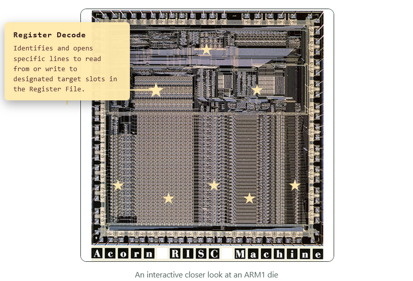

# RAMbuttan
Group 6 - S05

### Group Roster:
* Borromeo, Anton Miguel
* Dela Cruz, Mirai
* Reyes, Nicos
* Roldan, Beatrice
* Ruiz, Joseph Benjamin

> **Github Link:** https://github.com/miraiTee/ARCH2---VET-G6-S05-

> **Website Deployment Link** https://miraitee.github.io/ARCH2---VET-G6-S05-/ARM-architecture/#arm1-gate-level-simulation
---

### Brief Introduction to ARM Architecture
> Arm was officially founded as a company in November 1990 as Advanced RISC Machines Ltd, which was a joint venture between Acorn Computers, Apple Computer (now Apple Inc.), and VLSI Technology (now NXP Semiconductors N.V).

> "Arm (Advanced RISC Machine) CPU architecture is a reduced instruction set computing (RISC) architecture that defines how Arm processors execute instructions and interact with software. It underpins more than 350 billion shipped chips across markets from IoT and smartphones to data centers and supercomputers. With profiles optimized for applications, real-time, and microcontrollers, Arm delivers scalability, energy efficiency, security, and broad ecosystem support unmatched by other processor architectures."

---

### Exhibit 
> The exhibit’s goal is to introduce people to ARM architecture. The exhibit will also feature different companies alongside ARM during that time. The exhibit will explain what and how CPU architecture works and demonstrate the difference between a CISC (Complex Instruction Set Computing) architecture and RISC. 

#### Relevant Topics to be covered:
* CPU Architecture.
* CISC vs RISC architecture
* Focused on developments in ARM architecture and its models, and as a company.
* Related machines that use ARM architecture in life.

---

### ● History to be covered.
The exhibit will show the state and developments in computer architecture at the time such as the early days with Acorn’s Computer’s BBC Microchip and ARM’s first chip, the ARM V1. The ARM V2, ARM V3, and so on. The exhibit will also explore the different machines associated with each ARM model as well as the venture ARM company had such as with Apple and Steve Jobs. The exhibit follows ARM's evolution from the early ARM1, ARM2, and ARM3 processors, explaining how its simple and efficient RISC design laid the foundation for its success. It also introduces the modern Cortex processor families and ARM Neoverse, showing how ARM has expanded to power everything from embedded systems and mobile devices to enterprise servers and AI infrastructure.

* Section 1 details the history of ARM chips from its developed under Acorn Computers that would eventually lead to the ARM1.
* Section 2 details the ARM Classic in question such as the aforementioned ARM1, with an interactive element that displays the parts that would eventually shape its efficiency. Other such chips like the ARM2 and ARM3 have major improvements from the ARM1 in terms of its fabrication efficiency as well as the performance.
* Section 3 showcases the different types of ARM Cortex, used for consumer devices such as cellphones and smartphones as well as embedded devices.
* Section 4 showcases the ARM Neoverse, which are designed in mind servers, cloud computing, networking, and data centers as ARM supports AI computation.
* Section 5 shows a simulation of ARM1 in action under Gate Level Simulation.

---

### ● Tech Stack Plan:
* **Core:** Astro 6 + Node 26 + MDX + Native React hooks
* **Interactivity:** React
* **Styling:** Tailwind CSS + Motion

#### Interactive Element (Model Thing)
An Interactive Power-Efficiency Scale, showcasing ARM’s computing power in terms of MIPS throughout each major ARM chip developed in this. The diagram would feature an interactive slider representing historical eras, from the first ARM chip to present day. The slider would look like a battery cell, and as the user drags the slider the interface would change to showcase a specific milestone in that era. Additionally, we could add a small gamified element at the end of the diagram after the users have looked at all the eras of ARM chips. For example, it would ask the user to pick which chip would run properly given a strict power budget (users will answer using the info given from the diagram).

The exhibit also features a detailed look into the insides of the ARM1 Chip, through the use of stars that hover around each important area that displays information about it.

---

### ● References:
References
* Acorn Computers. (n.d.). ARM hardware reference manual. https://acorn.huininga.nl/pub/docs/manuals/Acorn/ARM%20Evaluation%20System/ARM%20Evaluation%20System%20-%20ARM%20Hardware%20Reference%20Manual.pdf
* Arc. (n.d.). ARM3. https://arcwiki.org.uk/index.php/ARM3
* Arm. (n.d.). Arm architecture. https://www.arm.com/architecture
* Arm. (n.d.). Arm official history. https://newsroom.arm.com/blog/arm-official-history
* Arm. (n.d.). A brief history of Arm, part 1. https://developer.arm.com/community/arm-community-blogs/b/architectures-and-processors-blog/posts/a-brief-history-of-arm-part-1
* BBC. (n.d.). BBC history. https://clp.bbcrewind.co.uk/history
* BBC Micro. (n.d.). The BBC Microcomputer. https://bbcmicro.computer/
* Computer History Museum. (n.d.). Acorn computers interview. https://archive.computerhistory.org/resources/access/text/2012/06/102746190-05-01-acc.pdf
* CPU Shack. (2010, March 31). The origin of ARM: New finds for the museum. https://www.cpushack.com/2010/03/31/the-origin-of-arm-new-finds-for-the-museum/
* Jia, J. (n.d.). CPU comparison: Branch prediction. https://jia.je/cpu/comparison.html#branch-prediction
* Ken Shirriff. (2015, December). Reverse engineering the ARM1. https://www.righto.com/2015/12/reverse-engineering-arm1-ancestor-of.html
* Sunstream Global. (n.d.). Exploring the applications of 32-bit ARM Cortex-M based microcontrollers. https://www.sunstreamglobal.com/exploring-the-applications-of-32-bit-arm-cortex-m-based-microcontrollers/
* Van Someren, A., & Atack, C. (n.d.). The ARM RISC chip: A programmer's guide. https://web.archive.org/web/20250805233033/http://arcarc.nl/archive/Books/The%20ARM%20RISC%20Chip%20-%20A%20Programmer's%20Guide%20-%20Alex%20Van%20Someren%20&%20Carol%20Atack/The%20ARM%20RISC%20Chip%20-%20A%20Programmer's%20Guide%20-%20Alex%20Van%20Someren%20&%20Carol%20Atack.pdf
* (ARM1 Gate Level Simulation) Visual6502. (n.d.). ARM1 visual simulation. http://visual6502.org/sim/varm/armgl.html
* Weir, J. (2022, September 22). A history of ARM, part 1: Building the first chip. Ars Technica. https://arstechnica.com/gadgets/2022/09/a-history-of-arm-part-1-building-the-first-chip/
* Weir, J. (2022, November 23). A history of ARM, part 2: Everything starts to come together. Ars Technica. https://arstechnica.com/gadgets/2022/11/a-history-of-arm-part-2-everything-starts-to-come-together/
* Weir, J. (2023, January 18). A history of ARM, part 3: Coming full circle. Ars Technica. https://arstechnica.com/gadgets/2023/01/a-history-of-arm-part-3-coming-full-circle/
* Wikipedia. (n.d.). Acorn Computers. https://en.wikipedia.org/wiki/Acorn_Computers
* Wikipedia. (n.d.). ARM architecture. https://en.wikipedia.org/wiki/ARM_architecture
* Wikipedia. (n.d.). List of ARM processors. https://en.wikipedia.org/wiki/List_of_ARM_processors
* Wikipedia. (n.d.). MOS Technology 6502. https://en.wikipedia.org/wiki/MOS_Technology_6502
